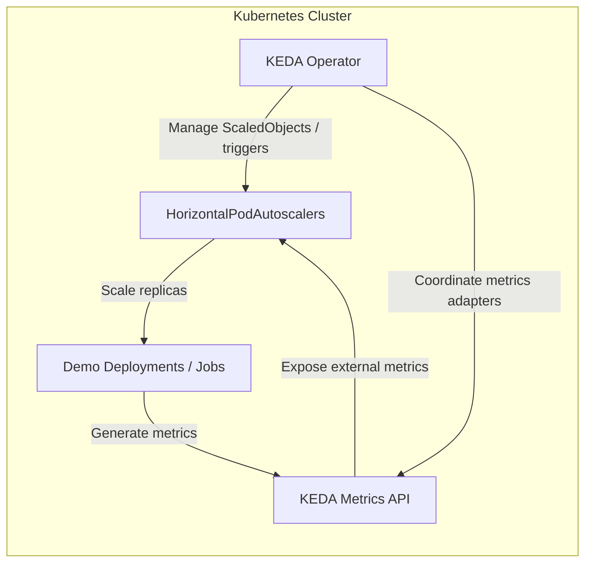
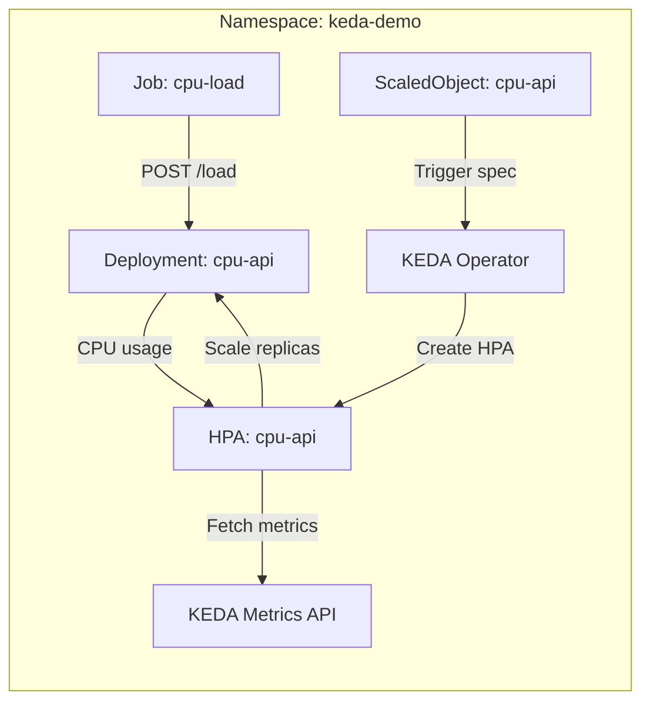
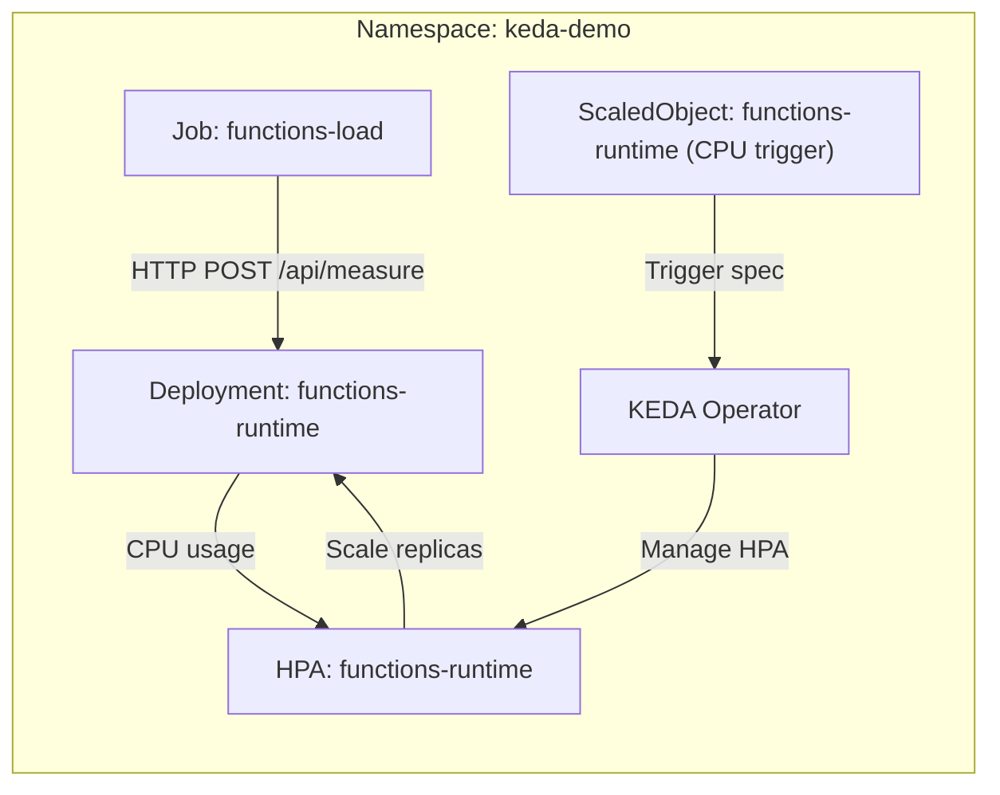
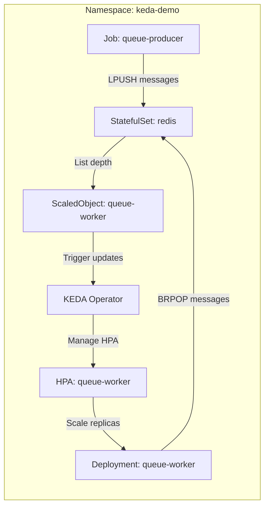
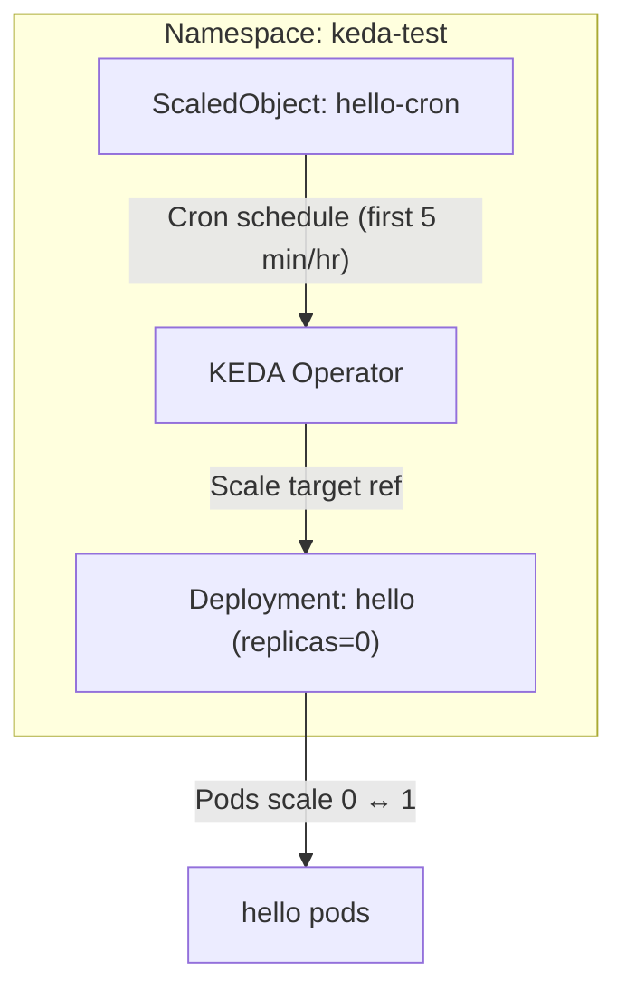

# Architecture & Flow

This primer explains how the demo workloads interact with KEDA and the underlying Kubernetes components. Even if you have not designed Kubernetes workloads before, the diagrams below show the relationships between pods, triggers, and autoscaling.

Key building blocks (with docs for further reading):

- [KEDA Operator](https://keda.sh/docs/latest/concepts/) – watches for `ScaledObject` resources and manages scaling.
- [KEDA Metrics API](https://keda.sh/docs/latest/concepts/external-scalers/) – exposes external metrics to Kubernetes.
- [Horizontal Pod Autoscaler (HPA)](https://kubernetes.io/docs/tasks/run-application/horizontal-pod-autoscale/) – the native controller that changes replica counts based on metrics.
- [Kubernetes Deployments](https://kubernetes.io/docs/concepts/workloads/controllers/deployment/) – manage the application pods you see scaling up and down.

## Overall Control Loop

KEDA owns the `ScaledObject`/`ScaledJob` custom resources. For each trigger you define, it provisions or updates an HPA targeting the workload deployment. The HPA fetches metrics from the KEDA metrics adapter and translates them into replica counts. Think of KEDA as the glue between an external signal (queue depth, cron schedule, HTTP load) and Kubernetes’ native scaling machinery.

## CPU Autoscaling Demo

The `cpu-load` helper launches a short-lived Job that POSTs a JSON payload to the ASP.NET API. That API spins CPU-bound workers for the requested duration, raising pod CPU usage. KEDA detects the sustained CPU signal, asks the HPA to increase replicas, and eventually scales back down when the pods return to idle.

## Azure Functions Autoscaling Demo

The `functions-load` job fires a burst of HTTP requests against the Azure Functions runtime hosted inside the cluster. The runtime executes the `Measure` function, which performs CPU-intensive work to simulate sensor calculations. KEDA observes CPU utilisation, adjusts the HPA, and scales the deployment between one and ten replicas to keep up with demand.

- **Note:** This scenario is disabled in the helper script unless you set `ENABLE_FUNCTIONS_DEMO=1` and build the container image on an AMD64-capable builder, because the official Azure Functions base image only ships x64 layers.
- Code: `src/functions-measure/`
- Kubernetes manifests: `manifests/functions-demo/`
- Automation: `./scripts/keda-demo.sh deploy-functions-demo`, `./scripts/keda-demo.sh functions-load`

## Redis Queue Autoscaling Demo

The `queue-producer` Job enqueues backlog into Redis using `LPUSH`. KEDA’s Redis scaler connects to the same list, measures its length, and feeds that metric to the HPA. As the backlog grows, the worker deployment scales out to drain the queue; once caught up, the replicas drop back toward zero. Because the scaler is external-metric driven, the deployment can truly reach zero pods without losing the ability to scale back up.

## Cron Smoke Test

The cron trigger schedules the deployment to one replica for the first five minutes of every hour (UTC) and zero otherwise. This demonstrates “scale to zero” based on a predictable timetable—ideal for workloads that only run during business hours or nightly maintenance windows.

If you want to explore further, inspect the manifests referenced in each section (`manifests/cpu-demo`, `manifests/queue-demo`, and `manifests/hello-*.yaml`) while keeping these diagrams handy.
