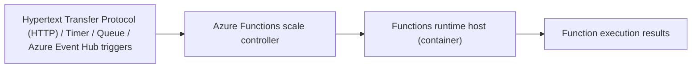

# Slide 04 – Azure Functions Architecture

  

## Talking Points

- Azure Functions combines a language-specific runtime host with a *scale controller* that reacts to triggers.
- Supported trigger types include Hypertext Transfer Protocol (HTTP), timer, queue, and Azure Event Hub events.
- Event volume influences the number of concurrent function hosts that run.
- Containerising the runtime allows the same triggers to scale on Kubernetes when paired with KEDA.

## Key Concepts

- **Scale controller** – monitors trigger sources and decides when additional runtimes should spin up.
- **Function app** – a logical grouping of functions that share the same runtime deployment and configuration.
- **Bindings** – declarative definitions that connect functions to event sources (inputs) and destinations (outputs).

## Try It Yourself

- Review a sample `host.json` file from an Azure Functions project to see how scaling and logging options map to on-premises deployments.
- Experiment with `func start` locally and trigger HTTP requests to observe concurrency behaviour.

## Related Documentation

- [Demo overview – CPU autoscaling section](../overview.md#cpu-autoscaling-demo-aspnet-core) – explains how the repository’s ASP.NET Core workload triggers Kubernetes Event-Driven Autoscaling (KEDA).

## Navigation

  <a href="slide-03.md">← Back</a>
  <a href="slide-05.md">Next →</a>

## Flow Diagram

*Diagram:* Triggers feed the scale controller, which governs how many runtime containers execute functions and emit results.
