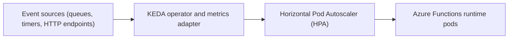

# Slide 06 – Azure Functions on Kubernetes

<p>
  <a href="https://learn.microsoft.com/azure/azure-functions/"></a>
  <a href="https://keda.sh/"></a>
  <a href="https://kubernetes.io/"></a>
</p>

## Talking Points

- Package the Azure Functions runtime into a container image and deploy it to Kubernetes.
- Combine that deployment with a Kubernetes Event-Driven Autoscaling (KEDA) `ScaledObject` so the runtime scales from zero to many pods based on event demand.
- Delivers an experience similar to the Azure Consumption Plan while keeping workloads inside your own cluster boundary.
- Enables platform teams to offer serverless ergonomics alongside existing Kubernetes tooling.

## Implementation Steps

1. Build a container image that wraps the Azure Functions runtime and your function code.
2. Deploy a Kubernetes `Deployment` (or `KService` if you use Knative) that references that image.
3. Create a KEDA `ScaledObject` pointing at the deployment and configure the desired trigger.
4. Load sample events (queue messages, HTTP requests) and watch `kubectl get deploy` to observe replica changes.

## Example Configuration

```yaml
# functions-deployment.yaml
apiVersion: apps/v1
kind: Deployment
metadata:
  name: functions-runtime
  namespace: apps
spec:
  replicas: 1
  selector:
    matchLabels:
      app: functions-runtime
  template:
    metadata:
      labels:
        app: functions-runtime
    spec:
      containers:
        - name: functions-runtime
          image: ghcr.io/your-org/azure-functions-demo:latest
          env:
            - name: AzureWebJobsStorage
              valueFrom:
                secretKeyRef:
                  name: functions-storage
                  key: connectionString
            - name: FUNCTIONS_WORKER_RUNTIME
              value: dotnet-isolated
          ports:
            - containerPort: 80
```

```yaml
# functions-queue-scaledobject.yaml
apiVersion: keda.sh/v1alpha1
kind: ScaledObject
metadata:
  name: functions-queue
  namespace: apps
spec:
  scaleTargetRef:
    name: functions-runtime
  pollingInterval: 15        # seconds
  cooldownPeriod: 60         # seconds
  minReplicaCount: 0
  maxReplicaCount: 20
  triggers:
    - type: azure-servicebus-queue
      metadata:
        queueName: orders
        messageCount: "10"
        namespace: my-servicebus
      authenticationRef:
        name: servicebus-secret
```

Apply both manifests, then send messages into the Service Bus queue to watch pods scale between zero and twenty replicas. Adjust `messageCount`, `pollingInterval`, and `maxReplicaCount` to tune responsiveness.

## Demo Assets

- Code: [`src/functions-measure/`](../src/functions-measure)
- Kubernetes manifests: [`manifests/functions-demo/`](../manifests/functions-demo)
- Automation scripts: `./scripts/keda-demo.sh deploy-functions-demo`, `./scripts/keda-demo.sh functions-load`

## Step-by-Step

1. `./scripts/keda-demo.sh deploy-functions-demo`
2. `./scripts/keda-demo.sh functions-load 400 25`
3. `kubectl get deploy -n keda-demo functions-runtime -w`
4. `kubectl logs -n keda-demo deploy/functions-runtime --tail=20`
5. `./scripts/keda-demo.sh remove-functions-demo`

## Considerations

- Ensure secrets for storage accounts, Service Bus namespaces, or Redis instances are provided via Kubernetes Secrets or managed identity integrations.
- Align `ScaledObject` polling intervals with the responsiveness expectations of your end users.

## Related Documentation

- [Demo overview – Redis queue autoscaling](../overview.md#redis-queue-autoscaling-demo-net-worker) – hands-on instructions for the queue scenario referenced in this slide.

## Navigation

<p>
  <a href="slide-05.md">← Back</a>
  <span style="float:right;"><a href="slide-07.md">Next →</a></span>
</p>

## Flow Diagram



*Diagram:* External events reach KEDA, which publishes metrics to the Horizontal Pod Autoscaler. The autoscaler increases or decreases the number of Azure Functions runtime pods.
