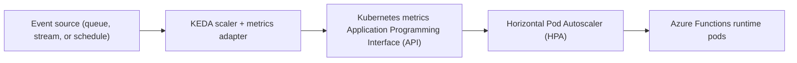

# Slide 09 – Example Architecture

  
  
  

## Talking Points

- Events push into a queue or event source where KEDA listens for activity.
- The KEDA scaler exposes metrics to the Kubernetes metrics API, translating backlog into desired replica counts.
- The Horizontal Pod Autoscaler (HPA) adjusts the Azure Functions deployment to meet demand.
- Monitor the feedback loop for bottlenecks such as queue throughput, cold starts, or resource quotas.

## Flow Diagram

*Diagram:* Event sources feed KEDA, which publishes external metrics for the HPA. The HPA scales the function pods to keep pace with demand.

## Hands-On Exercise

- Deploy the queue demo from this repository (`./scripts/keda-demo.sh deploy-queue-demo`).
- Run `./scripts/keda-demo.sh enqueue 200` to create a backlog and follow `kubectl get deploy -n keda-demo queue-worker -w` to watch live scaling.
- Compare the observed behaviour with the flow diagram and identify where metrics are exposed.

## Related Documentation

- [Architecture & flow – Redis queue autoscaling demo](../architecture.md#redis-queue-autoscaling-demo) – detailed explanation of the components referenced in this exercise.

## Demo Assets

- Worker code: [`src/queue-worker/`](../src/queue-worker)
- Producer code: [`src/queue-producer/`](../src/queue-producer)
- Kubernetes manifests: [`manifests/queue-demo/`](../manifests/queue-demo)
- Automation commands: `./scripts/keda-demo.sh deploy-queue-demo`, `./scripts/keda-demo.sh enqueue`, `./scripts/keda-demo.sh queue-depth`

## Scenario Snapshot

- **Trigger** – a major tour announcement drives a sudden spike in ticket purchases. Queue depth jumps from zero to thousands within seconds.  
- **Response** – KEDA monitors the queue backlog, signalling the HPA to scale processing pods from one replica to dozens within half a minute.  
- **Recovery** – once the backlog drains, KEDA gradually scales back to a minimal footprint, conserving infrastructure spend.

## Navigation

  <a href="slide-08.md">← Back</a>
  <a href="slide-10.md">Next →</a>

